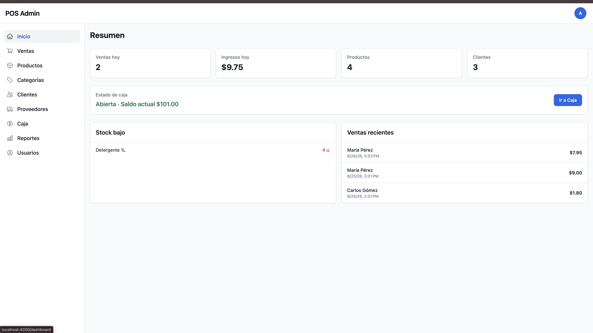
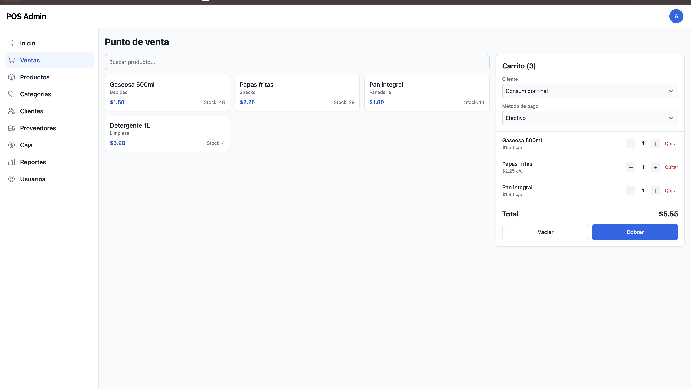

<p align="center">
  
</p>

<h1 align="center">POS ADAVAM — Frontend</h1>

<p align="center">
  Sistema de Punto de Venta moderno construido con <strong>Angular 22</strong>, Tailwind CSS y Flowbite.
</p>

---

## 📸 Capturas de pantalla

<p align="center">
  
  <br/>
  <em>Pantalla de inicio de sesión</em>
</p>

<p align="center">
  
  <br/>
  <em>Dashboard principal del sistema</em>
</p>

---

## 📋 Descripción del proyecto

**POS ADAVAM** es el frontend de un sistema de Punto de Venta (POS) completo, diseñado para gestionar de manera eficiente las operaciones comerciales de un negocio. Permite administrar ventas, productos, categorías, clientes, proveedores, caja y reportes desde una interfaz web moderna, responsiva y segura.

La aplicación se comunica con un backend REST a través de una API, usando JWT para la autenticación y autorización de usuarios.

---

## ✨ Características principales

- 🔐 **Autenticación JWT** — Login y registro de usuarios con token seguro
- 🛒 **Módulo de Ventas** — Registro y consulta de transacciones
- 📦 **Gestión de Productos** — CRUD completo con categorías
- 🗂️ **Categorías** — Organización de productos por categoría
- 👥 **Clientes y Proveedores** — Gestión del directorio de contactos
- 💰 **Caja** — Control de apertura y cierre de caja registradora
- 📊 **Reportes** — Visualización de datos y estadísticas del negocio
- 👤 **Usuarios** — Administración de accesos y roles
- 🔔 **Notificaciones** — Alertas en tiempo real con `ngx-toastr`
- 🛡️ **Route Guard** — Protección de rutas privadas por token JWT

---

## 🔄 Flujo de usuario

```
Usuario no autenticado
       │
       ▼
  [ / ] → SignIn (Login)
       │
       │  Credenciales correctas → JWT guardado en localStorage
       ▼
  [ /dashboard ] → Dashboard (Layout principal)
       │
       ├── [ /dashboard ]            → Home (Resumen)
       ├── [ /dashboard/ventas ]     → Ventas
       ├── [ /dashboard/productos ]  → Productos
       ├── [ /dashboard/categorias ] → Categorías
       ├── [ /dashboard/clientes ]   → Clientes
       ├── [ /dashboard/proveedores ]→ Proveedores
       ├── [ /dashboard/caja ]       → Caja Registradora
       ├── [ /dashboard/reportes ]   → Reportes
       └── [ /dashboard/usuarios ]   → Usuarios
```

> Las rutas del dashboard están protegidas por el `GuardService`, que verifica la existencia del token JWT en `localStorage` antes de permitir el acceso.

---

## 🗂️ Estructura del proyecto

```
pos-frontend-with-angular/
├── public/                         # Archivos estáticos (logo, imágenes)
│   ├── logo.png
│   └── logo-single.png
├── src/
│   ├── app/
│   │   ├── admin/                  # Módulo privado (protegido por guard)
│   │   │   ├── dashboard/          # Layout principal con sidebar
│   │   │   ├── home/               # Resumen / inicio
│   │   │   ├── sales/              # Ventas
│   │   │   ├── products/           # Productos
│   │   │   ├── categories/         # Categorías
│   │   │   ├── customers/          # Clientes
│   │   │   ├── suppliers/          # Proveedores
│   │   │   ├── cash-register/      # Caja
│   │   │   ├── reports/            # Reportes
│   │   │   └── users/              # Usuarios
│   │   ├── interfaces/             # Tipos e interfaces TypeScript
│   │   ├── services/               # Servicios HTTP (CRUD por módulo)
│   │   │   ├── user.service.ts
│   │   │   ├── product.service.ts
│   │   │   ├── sale.service.ts
│   │   │   ├── category.service.ts
│   │   │   ├── customer.service.ts
│   │   │   ├── supplier.service.ts
│   │   │   ├── cash-register.service.ts
│   │   │   ├── error.service.ts
│   │   │   └── guard.service.ts
│   │   ├── shared/                 # Componentes compartidos (navbar, sidebar…)
│   │   ├── signin/                 # Componente de login
│   │   ├── signup/                 # Componente de registro
│   │   ├── utils/                  # Interceptores HTTP (JWT token)
│   │   ├── app.config.ts           # Configuración de providers (standalone)
│   │   ├── app.routes.ts           # Rutas principales
│   │   └── app.component.ts        # Componente raíz
│   ├── environments/               # Variables de entorno por build
│   └── index.html
├── .env                            # Variables de entorno locales (no versionado)
├── .env.example                    # Plantilla de variables de entorno
├── tailwind.config.js              # Configuración de Tailwind CSS
├── angular.json                    # Configuración del workspace Angular
├── tsconfig.json                   # Configuración de TypeScript
└── package.json
```

---

## 🛠️ Tech Stack

| Tecnología | Versión | Rol |
|---|---|---|
| Angular | 22.1.x | Framework principal |
| TypeScript | 6.0.x | Lenguaje |
| Tailwind CSS | 3.4.x | Estilos utilitarios |
| Flowbite | 2.5.x | Componentes UI |
| ngx-toastr | 20.0.x | Notificaciones |
| RxJS | 7.8.x | Programación reactiva |
| pnpm | 11.x | Gestor de paquetes |

---

## ⚙️ Instalación

### Prerequisitos

- **Node.js** `^22.22.3 || ^24.15.0 || >=26.0.0`
- **pnpm** `>=10` — [Instalar pnpm](https://pnpm.io/installation)
- **Angular CLI** `>=22`

```bash
# Instalar Angular CLI globalmente (si no lo tienes)
npm install -g @angular/cli
```

### Pasos

```bash
# 1. Clonar el repositorio
git clone <url-del-repositorio>
cd pos-frontend-with-angular

# 2. Instalar dependencias
pnpm install

# 3. Configurar variables de entorno
cp .env.example .env
# Editar .env con tu URL de API
```

---

## 🔧 Configuración

Crea o edita el archivo **`.env`** en la raíz del proyecto:

```env
NG_APP_API_URL=http://localhost:3001/
```

| Variable | Descripción | Ejemplo |
|---|---|---|
| `NG_APP_API_URL` | URL base del backend REST | `http://localhost:3001/` |

> El interceptor `AddTokenInterceptor` adjunta automáticamente el JWT a todas las peticiones HTTP salientes usando el header `Authorization: Bearer <token>`.

---

## 🚀 Comandos

```bash
# Servidor de desarrollo
pnpm start
# o
ng serve

# Build de producción
pnpm build

# Ejecutar tests
pnpm test

# Build en modo watch
pnpm watch
```

El servidor de desarrollo estará disponible en: **`http://localhost:4200`**

---

## 🤝 Contribuciones

Las contribuciones son bienvenidas. Por favor, abre un _issue_ primero para discutir los cambios que deseas realizar.

---

<p align="center">Desarrollado con ❤️ — ADAVAM</p>
